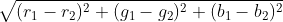
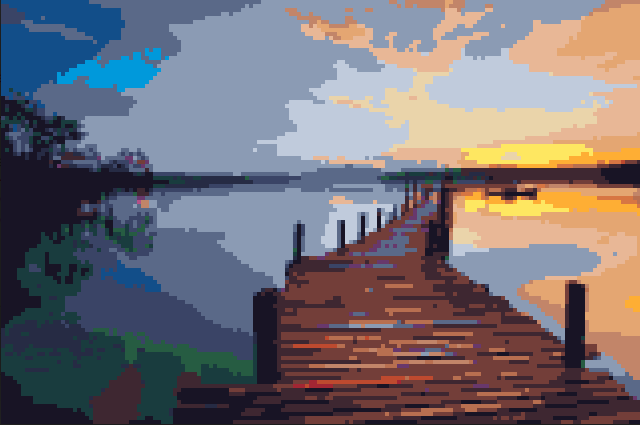

# CS50x - Final Project

I have always been a fan of pixel art.  I'm not very good at creating it, however. I decided that I wanted
to try and create a program that would pixelate a target image.  I thought this would be
possible since you can work with and manipulate pixels in python using the PIL library.

My program has three parts.  First, it takes the target image and shrinks it by 4 times.
For each 4x4 grid of pixels (16 pixels) in the target image, one pixel is created in a copy
image that is the average of those 16 pixels.  Second, the program takes each pixel in the
copied shrunken image,  and compares it to a palette of colors.  It uses the equation:

to calculate the distance between two RGB colors.  The program will calculate the distance
for the target color and each color in a palette of colors to determine which is the closest.
It will then return that RGB value for the pixel.  Third, the program will then enlarge the
new pixelated image by 4x.  I found that shrinking and then enlarging the image helps to
produce the "blocky" style that is commonly found in pixel art

### Here is an example of the program:

target image: 

Pixelated image: 

### GUI

Lastly, my program also contains a GUI/user interface that was written in Python using the
PySimpleGUI library.  When the program is run, it creates a window in which the user can
browse for an image and then load that image.  The program contains a list of the palettes
available and the user and click on a palette to see the colors in that palette.  The user can
also click a Pixelate! button to run the program, which will apply the selected palette
to the loaded image and then will show the pixelated copy of that image.

#### Notes on design choices

This program manually shrinks and enlarges the image to create a more blocky style.  I found
that using the resize method available in PIL did not create as clear an image, so instead I
created functions that can shrink or enlarge an image.  Additionally, I used the Stanford SimpleImage
library which applies a nice class based structure to PIL images for easier access to RGB values.

#### File Structure

My program has mutiple python files.  The simple-guy.py file is the GUI/user interface.  This file
is written using the PySimpleGUI library and creates the program for the user.  I found that it was
more user-friendly to create a GUI than to have the user pass through commands using the command line.

The GUI handles picking an image from disk, loading the image, viewing the palettes, and pixelating the image.
This allows the user to look at multiple palette choices without having to re-run the program.

The simpleimage.py file is the simpleimage library created by Stanford.  This file uses the PIL
library to add a class structure to image files, which allows for easier access to RGB values.  I used
this library to help pull RGB values from my image and from the palettes

The last file is the pixel_image_creator.py file which does the work of pixelating the image.
 This file takes in an image and a palette of colors, and then applys the palette of colors to the image,
 using a simple equation to determine which image in the palettes is "closest" to the target pixel. The
 program then returns the new, pixelated image so that it can be loaded into the GUI.
